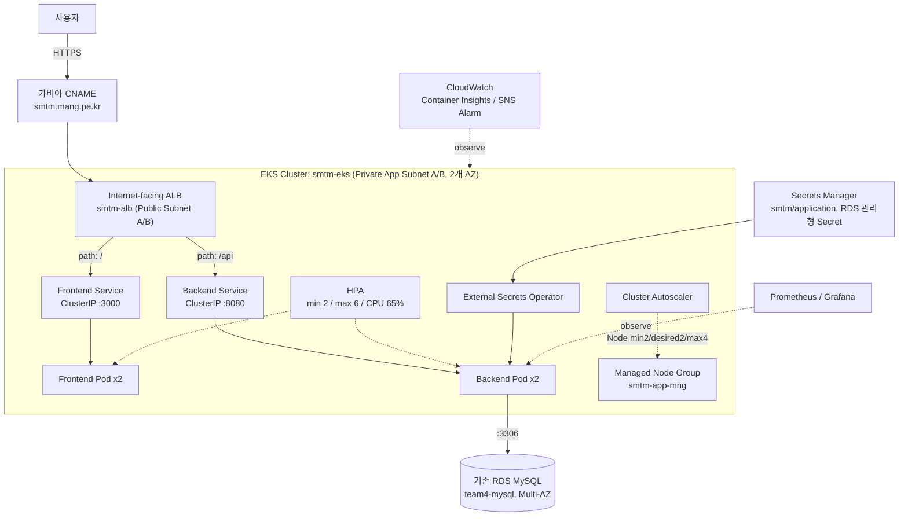

# ShowMeTheMoney-infra

## 프로젝트 개요

1차 프로젝트에서 구축한 개인 자산 관리 플랫폼 "Show Me The Money"의 인프라를 AWS 기반으로 전면 전환하는 2차 프로젝트입니다.

- 1차 프로젝트: https://github.com/YeonWoojuice/ShowMeTheMoney/tree/main

- **인프라 전환**: VMware Fusion 기반 온프레미스 Kubernetes → EC2+Docker Compose(임시 단계) → AWS EKS
- **데이터베이스**: RDS MySQL 적용으로 백업·복구 체계 강화
- **IaC**: Terraform 기반으로 인프라 재현성 확보(브라운필드 Import 진행 중)
- **CI/CD**: GitHub Actions + ECR + Helm으로 이미지 빌드·패키징 자동화, Argo CD 기반 GitOps 배포(예정)
- **모니터링**: CloudWatch·Prometheus·Grafana 도입으로 운영 안정성 강화
- **서비스 기능**: 1차 MVP(회원가입/로그인, 수입·지출 CRUD, 예산, 대시보드 등)를 유지하되, 1차에서 미흡했던 프론트-백엔드 API 스펙 사전 합의로 통합 안정성 개선

단순 가계부 MVP를 넘어 운영 가능한 클라우드 기반 금융 관리 서비스로 확장하는 것이 목표입니다.

## 진행 상태

| 영역 | 상태 |
|---|---|
| EC2 + Docker Compose + RDS + Nginx (`team4.mang.pe.kr`) | 완료, 롤백용으로 보존 중 |
| EKS 인프라 수동 구축(`smtm-eks`) — 네트워크·IAM·ECR·Node Group·Add-on·Controller | 완료 |
| Backend/Frontend Helm 배포 및 HTTPS 접속(`smtm.mang.pe.kr`) | 완료 |
| CloudWatch·SNS·Prometheus·Grafana 모니터링 | 진행 중 |
| HPA·Cluster Autoscaler·장애 복구 검증 | 진행 중 |
| Terraform Import(브라운필드) | 진행 중 |
| CI(GitHub Actions, ECR SHA 태그 자동화)·Argo CD | 미착수 |

세부 절차는 `docs/`의 브라운필드·그린필드 가이드 문서 세트를 따릅니다(아래 [문서 안내](#문서-안내) 참고).

## 아키텍처

### 현재 EKS 기반 트래픽 경로



### 참고: 기존 EC2 기반 경로(롤백용, 아직 운영 중)

```text
사용자 → 가비아 A 레코드 → EC2 Elastic IP
  → Nginx(EC2 호스트 직접 설치, Let's Encrypt)
    ├─ /api/* → 127.0.0.1:8080 (backend 컨테이너)
    └─ /*     → 127.0.0.1:3000 (frontend 컨테이너)
  → backend 컨테이너 → RDS MySQL(docker-compose 밖, AWS 관리형)
```

EC2 한 대에서 Docker Compose로 Frontend/Backend를 함께 실행하므로 EC2 장애 시 두 애플리케이션이 동시에 중단되는 단일 장애 지점이 있습니다. EKS 전환의 핵심 이유 중 하나입니다.

## AWS 리소스 스펙 요약

전체 리소스 명세(ID·ARN·태그까지 포함한 상세본)는 [`docs/SMTM_EC2_EKS_FULL_RESOURCE_SPEC.md`](docs/SMTM_EC2_EKS_FULL_RESOURCE_SPEC.md)(EC2+EKS 전체 비교)와 [`docs/SMTM_EKS_TRANSITION_NEW_RESOURCE_SPEC.md`](docs/SMTM_EKS_TRANSITION_NEW_RESOURCE_SPEC.md)(EKS 전환 신규 리소스만)를 참고하십시오. 아래는 핵심만 요약한 표입니다.

| 구분 | 값 |
|---|---|
| AWS Region | `ap-northeast-2` |
| VPC | `team4-vpc`(`10.21.0.0/16`, 기존 재사용) |
| EKS Cluster | `smtm-eks` |
| Managed Node Group | `smtm-app-mng` (Min 2 / Desired 2 / Max 4, `t3.medium`) |
| Namespace | `smtm` |
| ECR Repository | `smtm-backend`, `smtm-frontend` (Private, Scan on push) |
| RDS | 기존 `team4-mysql` 재사용(MySQL, Multi-AZ) |
| ALB | `smtm-alb` (Internet-facing, HTTP 80→HTTPS 443 Redirect) |
| ACM | `smtm.mang.pe.kr`, DNS 검증 |
| 서비스 도메인 | `smtm.mang.pe.kr` (가비아 CNAME) |
| 신규 리소스 접두사 / 공통 태그 | `smtm` / `Version=smtm-v1` |
| Pod Identity Role | `smtm-vpc-cni-role`, `smtm-lbc-role`, `smtm-eso-role`, `smtm-observability-role`, `smtm-cluster-autoscaler-role` |
| EKS Add-on | VPC CNI, CoreDNS, kube-proxy, Pod Identity Agent, CloudWatch Observability, Metrics Server |
| HPA | Backend/Frontend 공통 Min 2 / Max 6 / CPU 65% |
| PDB | Backend/Frontend 공통 `minAvailable: 1` |
| ECR Image Tag | **SHA 기반(`sha-<commit>`) 필수, `latest` 금지** — 현재 실 태그는 임시값 `pr11-review-p1`이며 SHA 태그 전환이 미완료 상태([리소스 스펙 §26](docs/SMTM_EC2_EKS_FULL_RESOURCE_SPEC.md#26-운영-전-추가-권장사항) 참고) |

## 폴더 구조

- `frontend/`, `backend/` — 애플리케이션 코드
- `helm/backend/`, `helm/frontend/` — EKS 배포용 Helm Chart(HPA·PDB·ExternalSecret·Ingress 포함)
- `docs/` — 아키텍처·리소스 명세·운영 가이드 문서 세트(아래 참고)
- `.github/workflows/ci.yml` — Backend 테스트, Frontend Lint/Build, Helm Lint/Template(`latest` 태그 자동 차단 포함), Docker Build 검증

## 문서 안내

인프라 구성은 아래 순서로 문서를 읽으면 전체 과정을 따라갈 수 있습니다.

| 순서 | 문서 | 내용 |
|---:|---|---|
| 참고 | [`docs/SMTM_EC2_EKS_FULL_RESOURCE_SPEC.md`](docs/SMTM_EC2_EKS_FULL_RESOURCE_SPEC.md) | EC2+EKS 전체 리소스 상세 명세, 검증 완료 상태, 운영 전 권장사항 |
| 참고 | [`docs/SMTM_EKS_TRANSITION_NEW_RESOURCE_SPEC.md`](docs/SMTM_EKS_TRANSITION_NEW_RESOURCE_SPEC.md) | EKS 전환 시 신규 추가된 리소스만 정리 |
| 참고 | [`docs/RESOURCE_NAMING_CONVENTION.md`](docs/RESOURCE_NAMING_CONVENTION.md) | 리소스 명명 규칙 |
| 참고 | [`docs/CI_CD_SCENARIO.md`](docs/CI_CD_SCENARIO.md) | CI/CD 시나리오, 이 문서 상단 안내 참고) |
| 참고 | [`docs/EKS_HELM_CHECKLIST.md`](docs/EKS_HELM_CHECKLIST.md) | Helm 배포 전 팀원과 확정해야 하는 값 체크리스트 |

## 사용법

### 로컬 개발(Docker Compose)

1. `.env.example` → `.env` 복사 후 값 채우기 (루트)
2. `backend/.env.example` → `backend/.env` 복사 후 값 채우기
3. RDS 없이 로컬 MySQL 컨테이너까지 함께 띄우려면:
   ```bash
   docker compose -f docker-compose.yml -f docker-compose.local.yml up --build
   ```
   기존 RDS를 그대로 쓰려면:
   ```bash
   docker compose up -d --build
   docker compose logs -f backend   # RDS 연결/Flyway 마이그레이션 확인
   ```

`docker compose build`는 태그를 지정하지 않으면 이미지에 `latest`가 붙습니다. 이 방식은 **로컬 개발 전용**이며 EKS/ECR로 올라가는 이미지가 아닙니다. EKS에 배포하는 이미지는 아래처럼 항상 SHA 태그를 명시해서 별도로 빌드합니다.

### EKS 배포용 이미지 빌드·Push(SHA 태그 필수)

```bash
export IMAGE_TAG="sha-$(git rev-parse --short=12 HEAD)"

docker build -t "${REGISTRY}/smtm-backend:${IMAGE_TAG}" ./backend
docker build --build-arg NEXT_PUBLIC_API_URL=https://<서비스-도메인> \
  -t "${REGISTRY}/smtm-frontend:${IMAGE_TAG}" ./frontend

docker push "${REGISTRY}/smtm-backend:${IMAGE_TAG}"
docker push "${REGISTRY}/smtm-frontend:${IMAGE_TAG}"

helm upgrade --install smtm-backend helm/backend \
  --namespace smtm -f helm/backend/values-prod.yaml \
  --set-string image.tag="${IMAGE_TAG}" --atomic --wait
```

`latest` 태그는 사용하지 않습니다. `.github/workflows/ci.yml`의 `helm-check` Job이 렌더링된 Helm 매니페스트에서 `image: .*:latest` 패턴을 발견하면 CI를 실패시켜 이를 자동으로 막습니다. 현재 CI는 Backend 테스트, Frontend Lint/Build, Helm Lint/Template, Docker Build 검증까지만 수행하며, ECR Push와 EKS 배포(CD)는 아직 Workflow에 구현되어 있지 않습니다 — 구현 시 이미지 태그는 반드시 `sha-<commit>` 규칙을 따릅니다.

### EKS 클러스터 접근

```bash
aws eks update-kubeconfig --region ap-northeast-2 --name smtm-eks
kubectl -n smtm get deploy,pod,svc,ingress,hpa,pdb
```

전체 구축·운영·검증 절차는 `docs/` 브라운필드·그린필드 가이드 문서 세트를 따릅니다(위 [문서 안내](#문서-안내) 참고).

### 환경변수(로컬/EC2 Docker Compose 기준)

**루트 `.env`** (frontend 빌드용, `docker-compose.yml`이 직접 참조)

| 변수 | 설명 |
| --- | --- |
| `NEXT_PUBLIC_API_URL` | 브라우저가 API를 호출할 base URL. **반드시 도메인만** 넣기 (예: `https://team4.mang.pe.kr`). `/api`를 붙이면 안 됨 — 프론트 코드가 `/api/auth/login`처럼 각 호출 경로에 이미 `/api`를 포함하고 있어서, 여기 붙이면 `/api/api/...`로 중복돼 404가 남 |

**`backend/.env`**

| 변수 | 설명 |
| --- | --- |
| `DB_HOST` | RDS 엔드포인트만 입력 (전체 JDBC URL 아님) |
| `DB_PORT`, `DB_NAME` | 기본값(3306 / showmethemoney) 그대로 둬도 됨 |
| `DB_USERNAME`, `DB_PASSWORD` | RDS 계정 |
| `DB_SSL_MODE` | DB 접속 TLS 모드. 미지정 시 `DISABLED`(로컬 db 컨테이너 기준). **운영 RDS에서는 반드시 `REQUIRED`** |
| `JWT_SECRET`, `JWT_EXPIRATION` | JWT 설정 |
| `CORS_ALLOWED_ORIGINS` | 운영 도메인 (예: `https://team4.mang.pe.kr`) |

EKS 배포에서는 위 값들을 `.env` 대신 Helm `values-prod.yaml`의 ConfigMap과 `ExternalSecret`(Secrets Manager 연동)으로 관리합니다. 

### 자주 겪는 함정

- **`NEXT_PUBLIC_*` 값은 빌드 타임에 번들에 박힘** — `.env` 고친 뒤 컨테이너만 재시작하면 반영 안 됨. 반드시 `docker compose build frontend`로 재빌드 필요.
- **nginx에 `/api/` 프록시 블록이 없으면**(EC2 경로) 모든 요청이 frontend(3000)로만 흘러가서, 존재하지 않는 라우트에 대해 Next.js 자체 404 페이지가 뜸.
- **MySQL 8 인증 방식** 때문에 `DB_URL`(application.yml에서 조합됨)에 `allowPublicKeyRetrieval=true`가 빠지면 RDS 연결 시 `Public Key Retrieval is not allowed` 에러 발생.
- **EKS에서 `docker compose build` 습관대로 이미지를 만들면 `latest` 태그가 붙어 CI Helm 검사에서 막힘** — 반드시 `docker build -t ...:${IMAGE_TAG}`로 SHA 태그를 명시.
